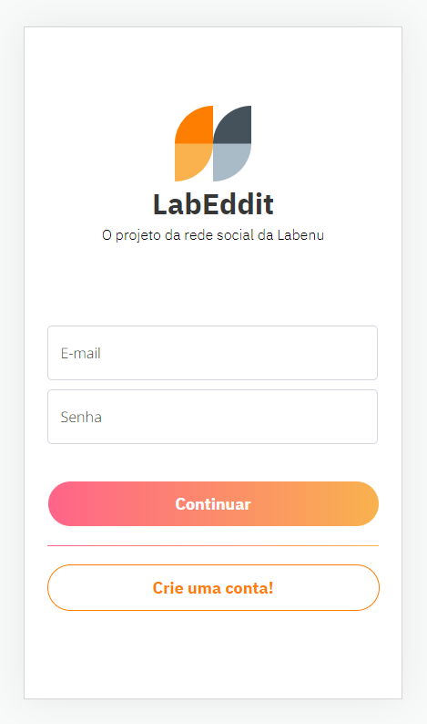
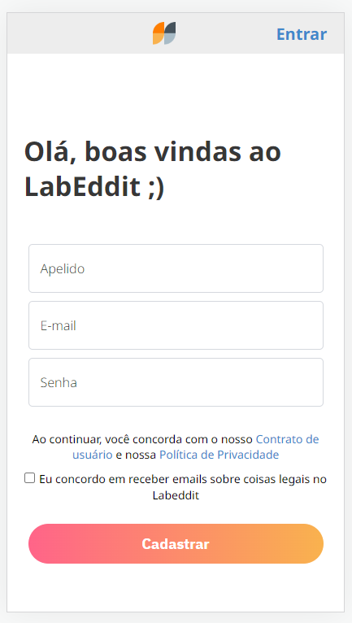
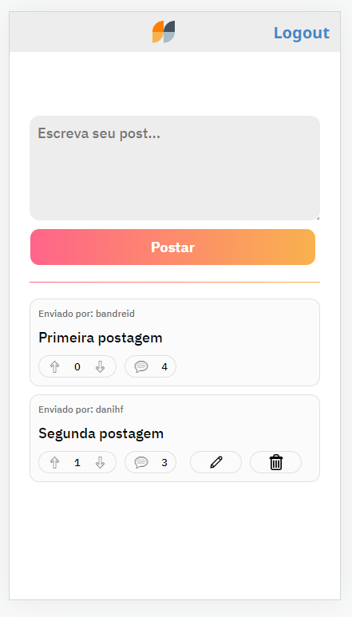
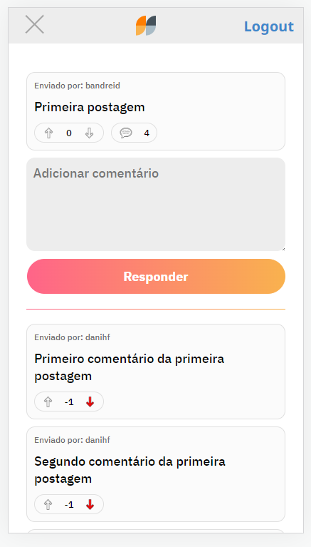

<p align="center">
 <a href="#-sobre-o-projeto">Sobre</a> •
 <a href="#-funcionalidades">Funcionalidades</a> •
 <a href="#-como-executar">Como executar</a> • 
 <a href="#-paginas">Páginas</a> • 
 <a href="#-tecnologias">Tecnologias</a> • 
</p>

## 💻 Sobre o projeto 

Labeddit é um projeto desenvolvido durante o **Bootcamp Web Full-Stack** da [Labenu](https://www.labenu.com.br/), de uma pequena rede social onde possibilita a iteração entre pessoas através de pequenas postagens, comentários em texto e reações de like(gostei) ou dislike (não gostei).

---

## ⚙️ Funcionalidades

  - [x] Signup - realização de cadastro ter acesso ao LabEddit.
  - [x] Login - realização da verificação de cadastro e o acesso ao LabEddit.
  - [x] Feed Page - página onde são carregados todos os posts e possibilita a criação de um novo post.
  - [x] Comment Page - página onde são carregados os comentário de um post especifico e possibilita a criação de um novo comentário sobre o post.
  - [x] Possibilidade de reação através de like(gostei) e dislike (não gostei) de posts e comentários
  - [x] Edição e deleção de posts ou comentário somente por quem criou o mesmo.

---

## 🚀 Como executar

### Pré-requisitos

#### Instalação
- [Git](https://git-scm.com) 
- [Node.js](https://nodejs.org/en/).
- [VSCode](https://code.visualstudio.com/).

#### 🎲 Rodando o template

```bash

# Clone este repositório
$ git clone https://github.com/silvaviniciuss/labeddit-frontend

# Acesse a pasta do projeto no terminal/cmd
$ cd labeddit-frontend

# Para abrir o vsCode
$ code .

# Instale as dependências
$ npm install

# Execute a aplicação
$ npm run dev

# O servidor inciará na porta:5173 

```

## 📄 Páginas


O Labeddit foi pensado no modelo mobile-first - (projetos web onde o foco inicial da arquitetura e desenvolvimento é direcionado aos dispositivos móveis, ou seja, seu layout e funcionalidades são desenvolvidos primeiramente para a tela do celular e a partir disso (se necessário) adaptado para telas maiores, como dos tablets ou desktops.)

### Página de Login



Necessário informar email e senha para entrar no LabEddit, caso alguma das informações não estiverem de acordar com o banco de dados irá retornar erro informando o ocorrido.

### Página de Signup



Informar apelido, um email válido e uma senha a sua escolha.
Não é possível cadastrar um apelido ou email que ja existem. Um erro irá retornar informando o ocorrido.

### Página de Feed



Página resposável pela visualização de todos os posts do LabEddit, na mesma possibilita a interação para criar uma novo post ou navegar entre os existes e também deixar um like ou dislike e algum dos posts.
Existe a opção de edição ou deleção de um post que só é visivel ao criador do mesmo.

### Página de Comments


Página responsável pela visualização dos comentários em um post. Também possibilida a interação para criar um novo comentário navegar entre os existes e deixar like ou dislikes nos comentários.
Existe a opção de edição ou deleção de um comentário que só é visivel ao criador do mesmo.

---

## 🛠 Tecnologias

- [API](https://developer.mozilla.org/pt-BR/docs/Learn/JavaScript/Client-side_web_APIs/Introduction)   
- [React](https://react.dev/)
- [React-Toastify](https://medium.com/@kimuradev/react-toastify-78f394cda71e)
- [React Router](https://reactrouter.com/en/main)
- [React Context](https://legacy.reactjs.org/docs/context.html)
- [Styled-components](https://styled-components.com/)
- [Axios](https://axios-http.com/ptbr/docs/intro)
- [Estado Global](https://coderpad.io/blog/development/global-state-management-react/)

---
